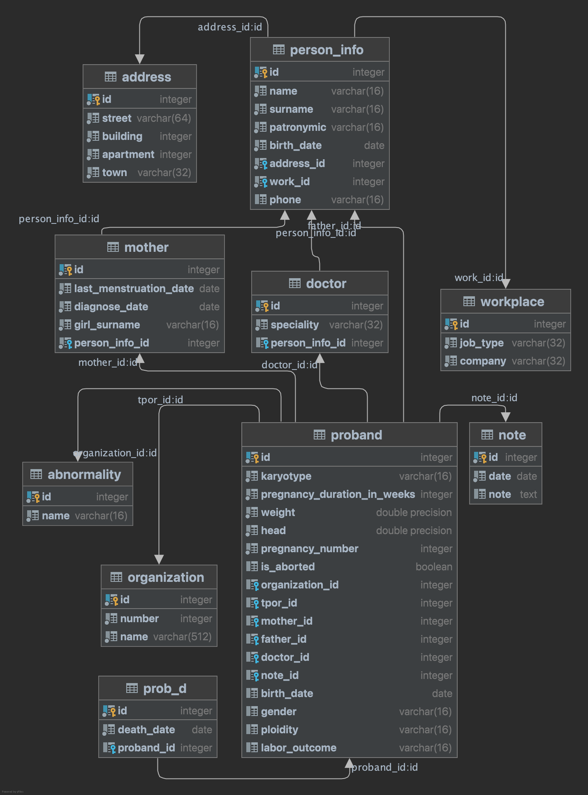

## Application for distributed access to the updated Republican database of congenital malformations

Implemented basic API with CRUD operations via REST.

### Prerequisites:

- Maven 3
- JDK 17
- Docker

### How to build:

    mvn clean install

### Start application

    docker compose up      

### Stop & remove image

    docker compose down --volumes && docker rmi vpr

### DB schema sructure

- PROBAND: proband description;
- ABNORMALITY: list of abnormalities;
- MOTHER: unique information about the mother, such as age at diagnosis or date of last menstruation;
- PERSON_INFO: stores unified personal information (mother, father of proband);
- ADDRESS: the address of the organization or the residence of the family of proband;
- WORKPLACE: information about parents workplace;
- PROB_D: information if proband is dead;
- ORGANIZATION: information about clinic;
- DOCTOR: information about healthcare provider;
- NOTE: additional info.

